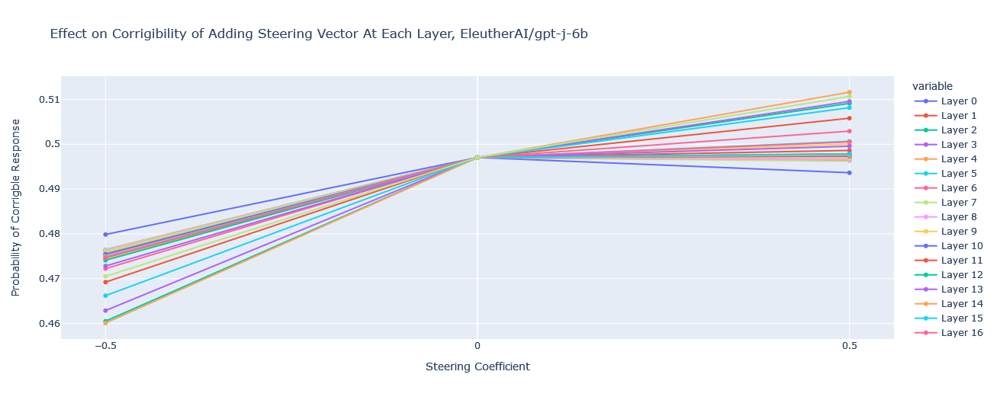
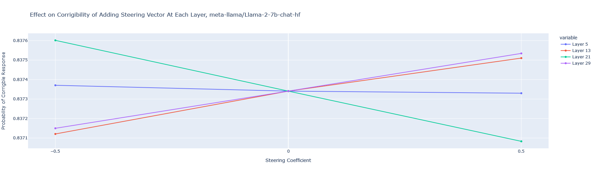

A replication of some of the experiments from [Steering Llama 2 via Contrastive Activation Addition](https://arxiv.org/abs/2312.06681v2) by Rimsky et al. (2023), with GPT-J and Llama 2, using [nnsight](https://nnsight.net/about/). Replication by Matt MacDermott and Michelle Viotti.

**Colab links:**

- [Activation Addition in GPT-J](https://colab.research.google.com/drive/1QJLWBqSkVe-tMr4MEk2b2X5NO0jWAJb9?usp=sharing)
- [Activation Addition in Llama](https://colab.research.google.com/drive/1RKt5fuXIIl1RvuheXm4GAhJOcT_Rd4SZ?usp=sharing)

**Results for GPT-J 6b** on Anthropic's corrigible-neutral-HHH dataset, using a mean difference vector calculated from 60 contrast pairs:

**And for Llama 2 Chat 7b**, from 50 contrast pairs:

